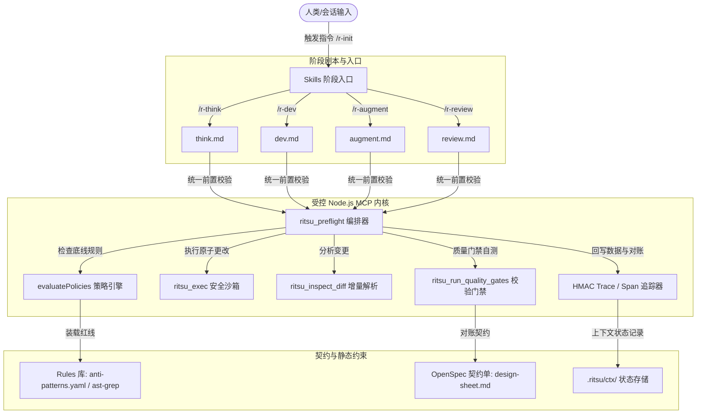

<div align="center">

# 律 (Ritsu) — 工业级 AI 协同标准与引擎
**Deterministic AI Engineering Lifecycle for High-Stakes Production Delivery**

[](https://github.com/3kaiu/Ritsu/actions/workflows/ci.yml)
[](https://codecov.io/gh/3kaiu/Ritsu)
[](AGENTS.md)
[](LICENSE)
[](runtime/package.json)

[快速开始](#-快速开始) • [核心理念](#-核心理念) • [系统架构](#-系统架构) • [Flagship 旗舰特性](#-flagship-旗舰特性-v65x) • [指令集](#-指令参考) • [CLI 工具](#-cli-工具) • [MCP 工具参考](#-mcp-工具参考-api) • [配置参考](#-配置与环境变量) • [参与贡献](CONTRIBUTING.md)

</div>

---

## ⚡ 核心理念：确定性 > 自动化

在生产级软件开发中，AI 的“盲目自动化”往往是引发代码雪崩和技术负债的最大隐患。**Ritsu (律)** 是一套专为 **Claude Code/Desktop** 和主流 AI 编码助手设计的工程协议与受控运行期，旨在将 AI 的工作流约束于严丝合缝的“阶段契约”中，实现确定性、高安全性的高质量工程交付。

### 🏗️ 六大核心支柱 (Six Pillars)
- 🛡️ **显式阶段契约 (Explicit Staging)**: 严密限制 AI 执行生命周期为 `Analyze` (分析/Think) → `Implement` (实现/Dev) → `Verify` (验证/Augment) → `Review` (评审/Review)，每一步皆有强模式约束的契约产物（设计单、自测报告、评审单等）。
- 📊 **自适应分级交付 (Tiered Delivery)**: 支持 Micro (P0) / Standard (P1) / Critical (P2) 任务分级。根据修改范围及影响面自动动态调整审核深度，完美兼顾“极速修复”与“重大重构”。
- 🔄 **智能断点续传 (Stateful Continuity)**: 通过本地 Context Store 记录完整的事件追踪树，支持网络中断、AI 报错或人工终止后的无缝断点续连。
- 🧩 **多维领域自适应 (Domain Adaptive)**: 自动提取前端、后端、全栈或数据开发等领域的底层指纹特征，动态装载匹配的工程红线约束。
- 🤝 **多智能体并发协同 (Multi-Agent Swarm)**: 提供分布式文件锁（Lease）与任务锁（Task Claim）协议，实现多模型、多子代理并发协同开发，从底层根除文件相互覆盖与竞态冲突。
- ⛓️ **防篡改与 Git 同步 (Secure Git-Sync)**: 引入 HMAC 数字签名校验保证链路不被篡改，并提供原生、防命令注入的 Git 分支间 `.ritsu` 数据同步引擎（`syncPush`/`syncPull`），无缝对接 CI/CD。

---

## 🧭 系统架构

Ritsu 的核心是一套三层本地优先（Local-First）架构，能够无缝桥接人类开发者的习惯、AI 终端指令以及本地静态分析分析引擎。



---

## 🌟 Flagship 旗舰特性 (v6.5.x)

### 1. 多智能体多并发无缝协同 (Multi-Agent Coordination)
当您启动多个子智能体进行并发开发时，Ritsu 可以保障他们的安全隔离与上下文链式传递：
* **链路级 Span 继承**：通过 `RITSU_TRACE_PARENT` 环境变量将父级 Trace/Span 状态无缝传递给子智能体，共享整个开发事务树。
* **文件独占租约 (File Lease)**：工具 `ritsu_claim_file` 允许 Agent 声明锁定特定文件。其他 Agent 尝试修改已锁定文件时，会被 Ritsu 强制拦截，防止并发覆盖。
* **分布式任务领用 (Task Claim)**：基于协调单（`coordination-sheet`），代理能调用 `ritsu_claim_task` 声明接管特定子任务，任务状态在多模型中透明流动。

### 2. 分支感知分布式状态同步 (Secure Git-Sync)
`.ritsu/` 状态存储在本地。为了解决多分支开发或团队开发下的同步漂移问题，Ritsu 提供了极其安全的同步引擎：
* **`syncPush` / `syncPull`**：自动且防命令注入地将当前分支的 `.ritsu/` 状态推送到分离的 Git 引用或临时分支中，并在切换分支或拉取 PR 时进行优雅合并与状态重构。
* **安全沙盒拦截**：严格采用正则表达式 `/^[a-zA-Z0-9._\-/]+$/` 对分支名参数进行过滤，从物理根源上切断任何潜在的 Shell 注入攻击隐患。

### 3. 冷热偏好学习与自愈 (Self-Healing Reconciler)
* **人机重合度特征提取**：自动拦截人类开发者对 AI 生成产物的二次手动微调，由 [miner.ts](runtime/src/miner.ts) 提取出差异特征。
* **自愈式偏好反哺**：将差异规律转化为偏好，自动追加到 `.ritsu/preferences.yaml`，并自动把偏好翻译重构为对应的 AST-grep 规则，实现规则的自适应演进。

---

## 🛠️ 快速开始

### 1. 一键智能安装与配置
在克隆/拉取本仓库后，直接在项目根目录下运行以下命令，即可自动化完成 **Node版本检测** $\rightarrow$ **静默安装依赖** $\rightarrow$ **TS代码构建** $\rightarrow$ **多宿主 (Claude Code/Cursor) MCP服务一键挂载** $\rightarrow$ **版本一致性自动对齐** $\rightarrow$ **生态Doctor自诊断** 的全套极速流程：
```bash
npm run setup
```

### 2. 安装 Skills 脚本
使用 `npx` 一键无感知地将 Ritsu 的 Markdown 协议动作集装载至您的 AI 会话中：
```bash
npx skills add 3kaiu/Ritsu -a claude-code -g -y
```

### 3. 初始化项目基线
在您的项目根目录中，键入 Ritsu 指令生成基础环境配置（这会创建 `AGENTS.md` 和 `.ritsu/` 目录）：
```bash
/r-init
```

### 🔄 极速零感更新自愈
当后续拉取了仓库的最新提交后，无需手动重新编译或重刷配置，只需直接在根目录下键入以下命令，即可安全实现**增量依赖重构、最新 TypeScript 重新构建编译、自动对账、以及 MCP 服务重新装载自愈**：
```bash
npm run update
```

---

## 🧭 指令参考

Ritsu 对 AI 助手暴露出阶段指令剧本。AI 在执行阶段工作前必须先校验当前契约。

| 交互指令 | 挂载角色 | 阶段目的 | 核心产出物 | 拦截红线要求 |
| :--- | :--- | :--- | :--- | :--- |
| **`/r-think`** | **架构师 (Architect)** | 需求梳理、方案对账、制定修改设计单契约。 | [design-sheet.md](_shared/artifact-templates.md#L4-L24) | 禁止空洞设计；契约必须规定具体受灾面和自测文件暗示。 |
| **`/r-dev`** | **开发者 (Developer)** | 原子化实现、防御式开发、执行单元测试自测。 | [dev-report.md](_shared/artifact-templates.md#L26-L51) | 严控命令注入风险；自测通过率必须 100%；不能留 placeholders。 |
| **`/r-augment`**| **质量工程师 (QA)** | 精准补测。对账 design-sheet 中的 contracts，填补测试覆盖率。 | [dev-report.md](_shared/artifact-templates.md#L26-L51) | 必须跑通门禁；覆盖率未上升时予以阻断警告。 |
| **`/r-review`** | **审计师 (Auditor)** | 红蓝对抗安全扫描，评估发布风险，检查违规。 | [assurance-sheet.md](_shared/artifact-templates.md#L53-L75)| 强模式检查；存在 Fatal 违规必须一键回滚/熔断硬阻断。 |
| **`/r-hunt`** | **诊断专家 (Hunted)** | 生产问题排查、锁定错误根因、输出复盘证据。 | [diagnosis.md](_shared/artifact-templates.md#L77-L100) | 必须具有明确的 MECE 假设和代码行追踪链。 |

---

## 🎛️ CLI 工具

Ritsu 提供了一款高性能的伴生 CLI，供开发者在控制台快速对账与检测健康度。

```bash
# 进入 runtime 目录或全局直接调用
ritsu --help

# 🔍 一键检测当前工作区的规约健康度及 MCP 挂载状态
ritsu doctor --ecosystem

# 📊 导出当月 AI 协作交付报表 (包含质量指标、决策轨迹等)
ritsu export --out MONTHLY_REPORT.md

# 🐱 倒序查看最近 10 条 AI 状态流转追踪明细
ritsu cat --recent 10

# 🔑 手动初始化一个 Trace HMAC 签名私钥（高安全性项目建议）
ritsu init-key
```

---

## 📦 仓库架构说明

```text
├── .github/                 # GitHub CI/CD 配置与自动化发布流程
├── _shared/                 # 核心协议规范
│   ├── artifact-schema.yaml # 产物 JSON Schema 校验
│   ├── artifact-templates.md# 规范产物 markdown 模板
│   ├── ctx-event-schema.json# HMAC Trace 追踪事件结构规范
│   └── mcp-tools.yaml       # 公共 MCP 暴露工具清单定义
├── docs/                    # 完整架构、多主机配置与技术 RFC 指南
├── domains/                 # 技术领域特异规则定义（前端/后端/全栈等）
├── rules/                   # 静态审计红线
│   ├── anti-patterns.yaml   # 全局反模式正则硬拦截红线
│   └── ast-grep/            # 自适应 ast-grep 语义结构检索规则
├── skills/                  # 各阶段剧本（think/dev/hunt/review）的 Markdown 协议
└── runtime/                 # 基于 Node.js/TypeScript 实现的受控运行时内核
    ├── src/                 # 核心源码 (orchestration 编排层, policy 策略引擎, handlers 处理器)
    ├── tests/               # 完整单元与集成测试套件 (47 文件, 254 测例)
    └── version-check.js     # 协议与仓库全局版本一致性对账引擎
```

---

## 🛠️ MCP 工具参考 (API)

Ritsu 运行时作为 MCP 服务器运行，共公开了 **20+ 核心原子工具**，供 AI 助手程序化调用。以下是核心工具的 API 清单：

| 工具名称 | 职责分类 | 核心输入参数 (Input Fields) | 典型返回载荷 (Output) | 说明与安全性约束 |
| :--- | :--- | :--- | :--- | :--- |
| `ritsu_preflight` | 编排调度 | `stage` (enum), `tier` (string), `task_summary` | `{ ok: boolean, context_pack: object }` | 一键式加载上下文、校验变更并检查 Policy。 |
| `ritsu_read_ctx` | 追踪恢复 | `detail` (boolean) | `{ last_incomplete, recent_entries, ... }` | 支持热偏好紧凑读取以大幅节省大模型 Token。 |
| `ritsu_write_artifact` | 产物写入 | `type` (enum), `filename`, `content` | `{ path: string, size_bytes: number }` | 强制通过 Schema 校验并拦截违规（Policy）。 |
| `ritsu_patch_artifact` | 增量补丁 | `filename`, `target_content`, `replacement_content` | `{ path: string, size_bytes: number }` | 使用增量块替换，防止全写，节约 90% Token。 |
| `ritsu_claim_file` | 并发文件锁| `path` (string), `span_id`, `ttl_ms` (optional) | `{ ok: boolean, path: string }` | 分布式文件锁定租约，防多 Agent 修改冲突。 |
| `ritsu_release_file` | 并发文件锁| `path` (string), `span_id` | `{ ok: boolean }` | 手动解除对应 Span 持有的文件排他锁。 |
| `ritsu_claim_task` | 并发任务锁| `span_id`, `agent_id` | `{ ok: boolean, message: string }` | 从协调单中声明接管特定任务，防止重复认领。 |
| `ritsu_run_quality_gates`| 质量校验 | `skip_lint`, `skip_test`, `trace_id`, `span_id` | `{ passed: boolean, lint: object, test: object }` | 在独立的临时分支或 worktree 中原子化校验测试。 |
| `ritsu_inspect_diff` | 增量检视 | `mode` (stat/chunks/full), `cached` | `{ mode, files: [], chunks: [], diff: "" }` | 支持智能 RiskScore 计算，仅对危险 chunk 预警。 |
| `ritsu_exec` | 沙箱指令 | `command`, `max_output_lines`, `timeout_ms` | `{ ok: boolean, output: string }` | 带有命令黑白名单过滤与 Shell 元字符硬阻断。 |
| `ritsu_verify_trace` | 签名审计 | `trace_id` | `{ valid: boolean, violation_count: number }` | 校验 Trace 链路中所有事件的 HMAC 签名可信度。 |

---

## ⚙️ 配置与环境变量

Ritsu 能够通过本地文件和系统环境变量进行深度微调：

### 1. 配置文件
* **`AGENTS.md`**: 声明当前项目的基线版本及策略降级/禁用选项（`rules_overrides`）。
* **`.ritsu/preferences.yaml`**: 本地自适应偏好。在 `review` 阶段，AI 记录的规范会在此落库，自动生成 AST 过滤。

### 2. 环境变量 (Environment Variables)
| 变量名 | 类型 | 默认值 | 作用说明 |
| :--- | :--- | :--- | :--- |
| `RITSU_PROJECT_ROOT` | `string` | `process.cwd()` | 指定 Ritsu 的物理项目根目录（用于测试沙箱或子系统）。 |
| `RITSU_STRICT_OUTPUT` | `boolean` | `true` | 为 `true` 时，若策略评估（Policy）检测到违反 Fatal 红线，则硬性阻断写入。 |
| `RITSU_HMAC_KEY` | `string` | `<auto-generated>` | 用于 Trace 事件签名的 256 位 HMAC 密钥。确保分布式多代理链路来源真实可靠。 |
| `RITSU_TRACE_PARENT` | `string` | `undefined` | 格式为 `traceId:parentSpanId`，供多智能体子会话继承父级事务树上下文。 |

---

## 🤝 参与贡献

我们极其欢迎来自开源社区的优化与特性贡献！
在您提起 Pull Request 之前，请遵循以下工程门禁：

1. **统一版本管理**：修改任何协议模板或运行时版本时，必须运行对账校验：
   ```bash
   node runtime/version-check.js
   # 或者执行自动对账同步：
   node runtime/version-check.js --write
   ```
2. **完整性测试校验**：确保所有 Vitest 测例 100% 通过且无 Lint 警报：
   ```bash
   npm --prefix runtime run lint
   npm --prefix runtime test
   ```
3. **安全提交规约**：为防范 CI/CD 漏洞和身份假冒，所有安全核心提交必须统一规范。详情请参阅我们的 [贡献指南 (CONTRIBUTING.md)](CONTRIBUTING.md)。

---

<div align="center">

### 律 (Ritsu) — 为确定性工程化而生。
Built with ❤️ by **The User + Antigravity AI Engineering Framework**

</div>
