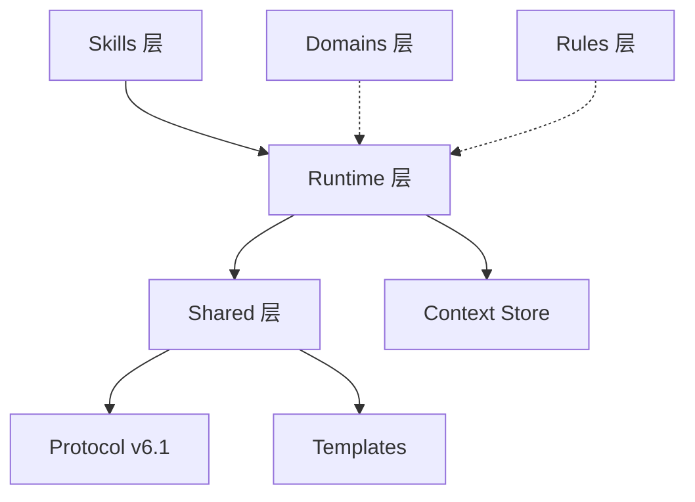

<div align="center">

# 律 (Ritsu) — 工业级 AI 协作标准
**Deterministic AI Engineering Lifecycle for High-Stakes Delivery**

[](https://github.com/3kaiu/Ritsu/actions/workflows/ci.yml)
[](https://codecov.io/gh/3kaiu/Ritsu)
[](AGENTS.md)
[](LICENSE)
[](runtime/package.json)

[快速开始](#-快速开始) • [核心理念](#-核心理念) • [指令集](#-指令参考) • [CLI 工具](#-cli-工具) • [贡献指南](CONTRIBUTING.md)

</div>

---

## ⚡ 核心理念：确定性 > 自动化

在生产级工程中，AI 的“盲目自动化”是最大的技术风险。**Ritsu** 建立了一套严丝合缝的工程契约，将 AI 的生产力牢牢锁定在确定性的轨道上。

### 🏗️ 六大支柱 (Six Pillars)
- 🛡️ **显式阶段 (Explicit Staging)**: 严格拆分 `Analyze` (分析/Think) → `Implement` (实现/Dev) → `Verify` (验证/Augment) → `Review` (评审/Review)，每步皆有机器可校验的契约产物。
- 📊 **分级交付 (Tiered Delivery)**: 根据任务复杂度及风险（Micro P0 / Standard P1 / Critical P2）动态调整工程深度，平衡敏捷性与严谨度。
- 🔄 **智能断点续传 (Stateful Continuity)**: 基于高可靠的 Context Store 实时计算任务断点，支持超长链路、网络中断或人工中断后的无缝恢复。
- 🧩 **领域自适应 (Domain Adaptive)**: 动态感应前端、后端、全栈、数据等特定工程指纹，实时匹配最佳规约与反模式红线。
- 🤝 **多智能体协作 (Multi-Agent Swarm)**: 借助 `coordination-sheet`、文件租约协议（File Lease）和分布式任务锁（Task Claim），防止多智能体并发开发时的文件覆写和任务竞态。
- ⛓️ **防篡改与分支同步 (Secure Git-Sync)**: 引入 HMAC 数字签名校验保证追踪链路不被篡改，并提供原生、防命令注入的 Git 分支间 `.ritsu` 数据同步引擎（`syncPush`/`syncPull`），天然匹配 PR/MR 评审流。

---

## 🛠️ 快速开始

### 1. 安装
```bash
npx skills add 3kaiu/Ritsu -a claude-code -g -y
```

### 2. 初始化项目
在项目根目录运行指令，生成项目基线：
```bash
/r-init
```

### 3. MCP（Claude Code）
`/r-init` 会生成项目根 `.mcp.json`。重载 MCP 后校验：
```bash
ritsu doctor --ecosystem
```

等价手动添加（可选）：
```bash
claude mcp add ritsu -- node runtime/dist/index.js
```

详见 [docs/integrations.md](docs/integrations.md) 与 [docs/ARCHITECTURE.md](docs/ARCHITECTURE.md)。

---

## 🧭 指令参考

Ritsu 提供了一套完整的工程流水线指令，覆盖从需求分析到最终验收的全生命周期。

| 指令 | 角色 | 核心任务 | 关键产出 |
| :--- | :--- | :--- | :--- |
| **`/r-think`** | 架构师 | 需求对账、方案博弈、技术契约确认 | `design-sheet.md` |
| **`/r-dev`** | 开发者 | 原子化实现、防御式编程、质量门禁自测 | `dev-report.md` |
| **`/r-review`** | 审计师 | 红蓝对抗评审、安全漏洞扫描、发布风险评估 | `assurance-sheet.md` |
| **`/r-hunt`** | 诊断专家 | 根因取证、MECE 假设验证、锁定根因 | `diagnosis.md` |
| **`/r-augment`** | 补测引擎 | 对账 design contract 与 coverage 缺口，补全测试断言 | `dev-report.md` |

---

## 🎛️ CLI 工具

内置高性能 CLI 工具，用于实时监测工程状态与健康度。

```bash
# 🔍 项目健康自检
ritsu doctor

# 📜 导出月度任务摘要 (Markdown)
ritsu export --out DELIVERY_REPORT.md

# 🐱 查看最近任务流水
ritsu cat --recent 10
```

---

## 📦 仓库架构



- **`skills/`**: 各工程阶段的显式入口。
- **`runtime/`**: 基于 Node.js 的 MCP 服务层，驱动事件流与工具调用。
- **`_shared/`**: 统一的产物 Schema 与协作协议。
- **`rules/`**: 全局工程红线与反模式库。
- **`docs/integrations.md`**: Claude-first MCP / OpenSpec / ast-grep 组合。
- **`docs/ARCHITECTURE.md`**: 三层架构与 MCP 收敛原则。

---

## 🤝 参与贡献

我们欢迎任何形式的贡献！在开始之前，请务必阅读我们的 [贡献指南](CONTRIBUTING.md)。

## 📄 许可证

本项目基于 **MIT License** 协议开源。详情见 [LICENSE](LICENSE)。

---

<div align="center">
Built with ❤️ by **The User + Antigravity AI**
</div>
